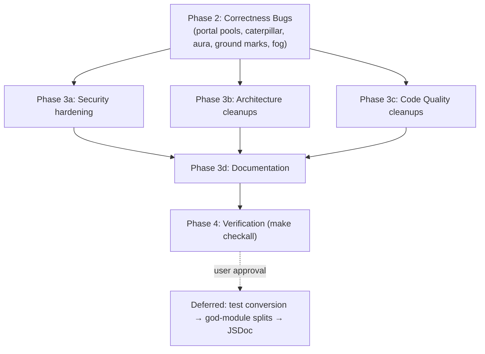

# Project Audit Report

> **Project**: small-world
> **Date**: 2026-07-03
> **Stack**: JavaScript (ES modules), Three.js, GLSL, Vite, GitHub Pages
> **Audited by**: Claude Code Audit System (4 parallel expert agents on Fable 5)

---

## Executive Summary

The project is in good health: `make checkall` passes cleanly, the seeded-RNG determinism window is implemented correctly with `try/finally` guarantees, security posture is strong for a static site (0 critical/high/medium findings), and disposal/performance discipline is well above average. The most impactful findings are two genuine runtime correctness bugs — **portal-preview contamination of the shared flora/creature resource pools** (visible wrong-biome materials in the live world) and a **caterpillar trail ring buffer that never trims** (unbounded memory + rising per-frame cost). Remediating the correctness bugs and medium cleanups is roughly 1–2 focused days; the deferred structural work (god-module splits, test-suite conversion) is a larger multi-session effort. Standout strength: the determinism mechanism and mip-chain bloom pipeline are exemplary, with constraint-explaining comments throughout.

### Issue Count by Severity

| Severity | Architecture | Security | Code Quality | Documentation | Total |
|----------|:-----------:|:--------:|:------------:|:-------------:|:-----:|
| 🔴 Critical | 0 | 0 | 0 | 0 | **0** |
| 🟠 High     | 4 | 0 | 9 | 3 | **16** |
| 🟡 Medium   | 10 | 0 | 15 | 3 | **28** |
| 🔵 Low      | 11 | 4 | ~20 | 4 | **~39** |
| **Total**   | **25** | **4** | **~44** | **10** | **~83** |

Note: several findings were reported by both the architecture and code-quality agents (portal/pool issues, `ui.js` god module, fur `uLayers`, music error handling). They are deduplicated below — each carries one canonical ID.

---

## 🔴 Critical Issues (Resolve Immediately)

None found.

---

## 🟠 High Priority Issues

### [QA-001] Portal preview contaminates shared flora/creature pools with wrong-biome materials
- **Area**: Code Quality (correctness)
- **Location**: `src/portal.js:500-530,554-576`; `src/flora/_shared.js:104-106`; `src/flora/trees.js:30`
- **Description**: Pooled flora resources are cached under kind-only keys (e.g. `"tree.leaves.mat"`) whose factories close over the biome that built them. Portal previews build with the **target** biome before the real world's flora loop runs, so shared flora kinds get pool entries from the wrong palette; the live world then renders them.
- **Impact**: Visible cross-biome color/material contamination whenever a portal is present and flora kinds overlap (portal preview is on by default).
- **Remedy**: Build portal previews against an isolated pool instance (preferred) or include biome id in pool keys.

### [QA-002] `disposePreviewOriginal` disposes resources still cached in the shared pools
- **Area**: Code Quality (correctness)
- **Location**: `src/portal.js:305-344`
- **Description**: The retained set is collected only from `state.world`'s children at portal-build time, never including geometries/materials the preview builders cached into `_floraPool`/`_creaturePool`. Pooled handles get disposed while still referenced.
- **Impact**: Hidden re-upload/recompile perf hitches; combined with QA-001, the live world can render from disposed wrong-biome handles.
- **Remedy**: Same fix as QA-001 — isolate preview pools; then delete the retained-set machinery. Also fixes [QA-026] (per-object full-scene re-traversal).

### [ARC-004] `disposeGroup` is pool-unaware — rejected placements can dispose pooled resources
- **Area**: Architecture (correctness)
- **Location**: `src/state.js:206-218`; `src/fauna/creature.js:460-476,683-688`; rejection paths `src/world.js:1415,1430,1475,1505,1533`
- **Description**: If the *first* consumer of a pooled geometry/material is rejected during placement and individually `disposeGroup`'d, the pool Map still holds the now-disposed handle; the next consumer gets a disposed resource.
- **Impact**: Latent placement-order-dependent rendering bug, very hard to reproduce.
- **Remedy**: Pool-aware disposal — pass a "skip set" of pooled resources to `disposeGroup` (or a variant) for individual-reject paths.

### [QA-003] Caterpillar trail ring buffer never trims — unbounded growth
- **Area**: Code Quality (correctness/performance)
- **Location**: `src/fauna/caterpillar.js:101-111` (`ringTrimByDistance`)
- **Description**: `arc[]` is monotonic; the trim loop scans downward and returns at the first index exceeding `maxDistance`, which is always the last index — a no-op. Simulated: 3,850 points after one minute vs. an intended ~3.4-unit cap.
- **Impact**: Per-caterpillar memory grows without bound; `ringPushHead`'s O(len) `copyWithin` + arc-shift makes per-frame cost rise linearly with session length.
- **Remedy**: Scan ascending, cut at the first index exceeding `maxDistance` (`tr.len = i + 1`). Add a behavioral test.

### [QA-004] `* 1000` multiplier yields ~3.2 million line segments for grass-pattern edge auras
- **Area**: Code Quality (performance)
- **Location**: `src/sky.js:604` (`makeIslandEdgeMist`), default `lineDensity` at line 603
- **Description**: `count = Math.round((LOWFX ? 1100 : 3200) * 1000 * lineDensity)` — with default `lineDensity = 1`, ~3.2M segments (~128 MB attribute data) built inside the seeded regen window. Reads like a leftover scale typo. The `LOWFX ? 1100` branch is dead (grass-pattern auras return `null` under LOWFX).
- **Impact**: Large allocation/GC spike and GPU footprint on every grass-aura biome regen.
- **Remedy**: Verify intended magnitude visually, fold into the base literal, remove the dead LOWFX branch.

### [QA-005] Ground-mark canvas fully repainted and re-uploaded to GPU every frame
- **Area**: Code Quality (performance)
- **Location**: `src/environment.js:736-746,812-823`
- **Description**: Any live mark triggers per-frame: clear 512×512 canvas, re-stamp up to 512 marks, allocate a fresh radial gradient per stamp, full texture re-upload. Eight of twelve biomes use ground marks.
- **Impact**: Sustained canvas rasterization, gradient GC churn, ~1 MB/frame upload.
- **Remedy**: Cache one unit radial gradient; throttle full repaints to ~10 Hz.

### [ARC-003] Portal preview's RNG replay coupled to `world.js` ordering only by comment
- **Area**: Architecture (correctness risk)
- **Location**: `src/portal.js:224-245` vs. `src/world.js:340-351`; duplicated `terrainAmp` at `portal.js:230` / `world.js:525`
- **Description**: Inserting one `Math.random()` between the biome roll and `pickLayout()` in `world.js` silently desyncs every portal preview from its destination, with no failing test.
- **Impact**: Silent preview/destination divergence.
- **Remedy**: Extract a shared `previewWorldPrefix(seed)` helper (or constant) consumed by both; move `terrainAmp` into `src/world-constants.js`; add a parity unit test.

### [QA-007] Three near-duplicate first-person camera-mode implementations
- **Area**: Code Quality
- **Location**: `src/ui.js:802-856` (stroll), `903-958` (fly), `2227-2299` (photo)
- **Description**: Each re-implements the same mouse-move handler, key mapping, pointer-lock state machine, and listener bookkeeping. The pointer-lock retry fix reached only stroll mode; photo mode re-inlines the pitch clamp.
- **Impact**: Fixes to one mode silently miss the other two (already happened once).
- **Remedy**: One `makeFirstPersonMode({fly, extraKeys, onExit})` helper used by all three.

### [ARC-001] `src/ui.js` is a 2,755-line god module (11 unrelated UI concerns) — **deferred, needs approval**
- **Area**: Architecture
- **Location**: `src/ui.js` whole file; `initUi` spans lines 392–2755 ([QA-006] is the same finding)
- **Remedy**: Split along existing seams into `src/ui/` sub-modules with an explicit UI-context object. Deferred: large refactor, blocked by test-suite conversion (see Remediation Plan).

### [ARC-002] `src/fauna/creature.js` (1,981 LOC) and `src/environment.js` (1,621 LOC) — incomplete extraction — **deferred, needs approval**
- **Area**: Architecture
- **Location**: see detailed findings
- **Remedy**: Finish the in-progress splits (mound/perch/sleepZ/landing; particles/decals/groundcover/water/swarms). Deferred for same reason as ARC-001.

### [QA-008] `generateWorld` is a ~1,360-line function — **deferred, needs approval**
- **Area**: Code Quality
- **Location**: `src/world.js:287-1652`
- **Remedy**: Extract portal placement, flora placement, and fauna population into modules. Must land **after** QA-001/QA-002 pool isolation.

### [QA-009] Test suite is dominated by source-text grepping, not behavior testing — **deferred, needs approval**
- **Area**: Code Quality (test quality)
- **Location**: 53 of 68 `tests/*.test.mjs` + all 6 `tests/test_*.py`
- **Description**: Tests assert literal code fragments; any refactor breaks them without behavior change, while behavioral regressions can pass. Core simulation logic (flier FSM, `ui.js`, `postfx.js`, day/night, grass pushers) has near-zero behavioral coverage.
- **Remedy**: Convert config/data invariants to import-and-assert; export tuning constants; reserve grepping for GLSL. Should precede the god-module splits.

### [DOC-001] CLAUDE.md module inventory is stale after the 1.5.8 structural refactor
- **Area**: Documentation
- **Location**: `CLAUDE.md` Architecture section
- **Description**: Missing: `src/flora/` split, `src/world-hud.js`, `src/world-constants.js`, `src/ui/storage.js`, `src/catalog.js`, `src/photoSubject.js`; wrong location for `GRASS_DENSITY_BASE`; no mention of the `stepCreature` per-mode dispatcher split.
- **Remedy**: Rewrite the module inventory to match current structure.

### [DOC-002] CLAUDE.md contradicts itself and the code about importmap/CDN loading
- **Area**: Documentation
- **Location**: `CLAUDE.md` "Navigation quick start" + Architecture intro
- **Remedy**: Rewrite the two stale sentences (Vite-bundled ES module graph; `index.html` provides only HUD markup).

### [DOC-003] The ~80-file test suite is undocumented everywhere
- **Area**: Documentation
- **Location**: `CLAUDE.md`, `CONTRIBUTING.md`, `README.md`
- **Remedy**: Add a Testing section covering `make test`, single-test invocation, the static-test convention, the JS/Python split, and `tests/determinism-seed.test.mjs` as the world-gen guardrail.

---

## 🟡 Medium Priority Issues

### Architecture
- **[ARC-005]** `state._reapplyWindSettings`/`_reapplyGrassSettings` back-channel inverts dependency direction; redundant 250ms poll (`src/ui.js:1221,1324,1852-1853`; `src/world.js:1335,1339`). Remedy: migrate onto the existing `"world-ready"` CustomEvent, remove the interval.
- **[ARC-006]** Two mechanisms for the same world→ui callback need (setter injection vs. `state._*` patches) (`src/world.js:93-99`, `main.js:159-162`). Remedy: standardize on setter injection.
- **[ARC-007]** Grass baseline constants (`25`, `0.96`) hand-duplicated across `state.js`/`ui.js`/`ui/storage.js`. Remedy: single canonical import.
- **[ARC-008]** `WATER_SURFACE_Y = -0.12` hand-copied across `world.js:877`, `main.js:261`, `environment.js`. Remedy: move to `world-constants.js`.
- **[ARC-009]** Butterfly/bee/bird/flier velocity-integrate/damp/cap/orient boilerplate duplicated (`butterfly.js:152-194`, `bee.js:150-185`, `birds.js:209-216`, `creature.js:1927-1932`). Remedy: shared `orientToVelocity` + integration helper.
- **[ARC-010]** Five `biome.id === "..."` behavior branches violate the documented biome-flag pattern (`catalog.js:132`, `world.js:995,1080,1120,1379`). Remedy: add `hasWillOWisps`/`giantFlora`/`guaranteeBurrower`-style flags to `BIOMES`.
- **[ARC-011]** Nine near-identical LOWFX/pbrDetails fallback guards in `pbr.js`. Remedy: `pbrMaterialOr()` wrapper.
- **[ARC-012]** GLSL hash/noise helpers duplicated across five shader files (`sky.js` ×3, `grass.js`, `flora/volcanic.js`). Remedy: shared GLSL chunk module `src/shaders/noise.js`.
- **[ARC-013]** `inspect.js:82-309` re-derives wildflower/grassblade geometry instead of reusing production builders. Remedy: factor shared geometry builders.
- **[ARC-014]** `music.js` silently swallows all playback failures; crossfade `setTimeout` not cancelled by `_fadeId` bump (`music.js:125-197,149-158`). Remedy: `error` listener + monotonic switch-id cancellation. (= QA-020)

### Code Quality
- **[QA-010]** `stepCreature` remains ~600 lines with compound guards (`creature.js:1380-1981`). Remedy: extract `moveCreature`/`positionCreatureY`/`animateCreature`. *(Deferred with the god-module work.)*
- **[QA-011]** `pushOutOfObstacles` grid and fallback paths verbatim-duplicated (`fauna/shared.js:373-412`). Remedy: resolve candidates first, one shared body.
- **[QA-012]** `ringFindAt`/`ringGet` allocate per call; interpolated branch omits `y` (`caterpillar.js:51-54,115-136,562-577`). Remedy: caller-supplied scratch; always set `y`.
- **[QA-013]** Wet-depth closure, flatten smoothstep, footprint sampler duplicated world↔portal (`world.js:525-968` vs `portal.js:135-457`). Remedy: share via `world-constants.js` (with ARC-003).
- **[QA-014]** Giant-mushroom/leafballtree placement blocks near-duplicate; clamp expression ×4 (`world.js:1080-1169,804,1038,1096,1143`). Remedy: `tryPromoteGiant()` + helper.
- **[QA-015]** `edgeAura` config duplicated verbatim across all twelve biomes (~100 lines). Remedy: `EDGE_AURA_DEFAULTS` + per-biome spread.
- **[QA-016]** `onBeforeCompile` string-patches have no anchor-match verification (`environment.js:663-667,1523-1585`, `grass.js:172-284`, `pbr.js:757`). Remedy: `replaceOrWarn` helper.
- **[QA-017]** `sharedFurUniforms.uLayers` monotonically ratchets across regens, shared by all creatures (`fur.js:183`). Remedy: per-template `uLayers`; only `uLightDir` stays global.
- **[QA-018]** Sand/cinder particles do per-particle three-octave `heightFn` + obstacle loops every frame (~10k noise evals/frame) (`environment.js:148,340-363`). Remedy: coarse baked height grid + pre-filtered obstacles per regen.
- **[QA-019]** Grass field pre-allocates ~1.63M instances (~130 MB) on the default-density path (`grass.js:26,311-351`). Deliberate design — verify with `?perf=1` before changing; consider lowering the ceiling.
- **[QA-020]** Catalog save buttons `await` unguarded async (stuck "saving..."); music crossfade race + missing error listener (`ui.js:1997-2010`; `music.js:149-158`). Remedy: try/catch + failure state; see ARC-014.
- **[QA-021]** `catalog.js` can strand orphaned metadata or blobs on partial failure (`catalog.js:166,199,259-277`). Remedy: reject on `tx.onerror`; sequence writes.
- **[QA-022]** `renderCatalogPanel` has no re-entrancy guard (`ui.js:438-561`). Remedy: generation counter.
- **[QA-023]** Python tests duplicate the same source-grep approach; second runtime dep for no gain (`Makefile:78-83`, `tests/test_*.py`). Remedy: port to `.mjs` — *after* QA-009 conversion.
- **[QA-024]** Photo-mode fog decay bug on cloudlike biomes: `scene.fog.density *= 0.55` per frame while paused, reset only runs unpaused (`main.js:447-452`, `world.js:235-240`, `ui.js:2187`). Remedy: compute as a factor, don't mutate cumulatively.
- **[QA-025]** Global keydown handler doesn't exclude focused `<select>` (music dropdown) — `r`/Space trigger regen/pause (`ui.js:2685-2686`). Remedy: add `SELECT` + `isContentEditable` to the guard.
- **[QA-026]** `disposePreviewOriginal` re-traverses the whole scene per preview object (`portal.js:305-321`). Resolved by the QA-001/002 pool-isolation fix.

### Documentation
- **[DOC-004]** Field Guide catalog / fly camera / locator / tour subsystems absent from CLAUDE.md; inspect-mode key list incomplete.
- **[DOC-005]** Python 3 requirement for `make checkall`/`make test` (and min Node version) unstated in CONTRIBUTING.md/README.
- **[DOC-006]** Near-zero JSDoc on 257 exported functions (4 of ~50 files have doc blocks). Remedy: JSDoc the cross-module public surface first. *(After refactors.)*

---

## 🔵 Low Priority / Improvements

### Security (all Low)
- **[SEC-001]** No CSP — add `<meta http-equiv="Content-Security-Policy">` to `index.html` (self + fonts.googleapis.com/gstatic + static.pardev.net media + data:/blob: img); verify against Vite build output first.
- **[SEC-002]** Google Fonts CDN dependency without SRI — optional: self-host via `@fontsource`.
- **[SEC-003]** Cross-origin music streaming — informational only; constrain with `media-src` if CSP added.
- **[SEC-004]** Persisted settings allowlisted by key but not type-validated (`src/ui/storage.js:71-88`) — coerce/clamp numerics on load.

### Architecture
- **[ARC-L01]** Unreachable dead branch in `generateWorld`'s stale-run guard (`world.js:296-306`).
- **[ARC-L02]** `pbrDetails` setting orphaned — not persisted, no UI control (`state.js:151`, `ui/storage.js:17-32`).
- **[ARC-L03]** `_cloudTex` singleton defeated by regen disposal (`sky.js:149-179`) — re-painted/re-uploaded every regen.
- **[ARC-L04]** `animate()`'s dynamic-collision rebuild runs while paused (`main.js:344`).
- **[ARC-L05]** Pause/dt/t logic spread across five places in `main.js`.
- **[ARC-L06]** `spawnZ` allocates a new `SpriteMaterial` per sleep-particle (`creature.js:268`).
- **[ARC-L07]** `+0.15` canopy air-pass margin repeated ×5 (`fauna/shared.js:257-396`) — extract `CANOPY_PASS_MARGIN`.
- **[ARC-L08]** `makeFlock` return shape lacks `.group` unlike every other entity (design choice; document it).
- **[ARC-L09]** Wing-flap sine loops and shortest-arc heading-slew idiom duplicated 3–4×.

### Code Quality
- **[QA-L01]** Dead/no-op code: identical ternary branches (`ui.js:682-684`); unreachable `if (INSPECT) return` (`ui.js:2687`); redundant condition in `wakeCreature` (`creature.js:1032-1033`); dead optional-chaining (`shadows.js:36-38`); unused `getAllCatalogEntries` (`catalog.js:147`).
- **[QA-L02]** Comment/code drift: `lowfx.js:10` says "< 480px" (code: 768); `state.js:11` + `world.js:572` say "38-unit base" (actual `DENSITY_BASE = 76`).
- **[QA-L03]** Shadowed variables: `e` (`ui.js:2727`), `n` (`creature.js:1793-1802`).
- **[QA-L04]** `generateIslandName(seed)` called twice per regen (`world-hud.js:52,65`); `getFlyerNestGroundPose` recomputes a known max (`world.js:741-744`).
- **[QA-L05]** Caterpillar eye materials/geometries allocated fresh per instance vs. pooled walker equivalents (`caterpillar.js:195-204`).
- **[QA-L06]** Disposal gaps: `customDepthMaterial` in `terrain.js`; cloned reflection dome material (`reflection.js:44`); per-texel `new THREE.Vector3()` in `pbr.js:187` (~147k/regen).
- **[QA-L07]** `parseSeed` accepts out-of-range (>16-bit) seeds (`seed.js:19-27`).
- **[QA-L08]** Six near-identical fullscreen-quad vertex shaders in `postfx.js`.
- **[QA-L09]** One disabled lint rule (`ui.js:1725`).

### Documentation
- **[DOC-007]** README hardcodes "Three.js r185" — drop version number.
- **[DOC-008]** README lacks CI/license badges.
- **[DOC-009]** No troubleshooting/FAQ (WebGL context loss, port 2001, music host, `?lowfx`/`?midfx`).
- **[DOC-010]** CLAUDE.md (~45 KB) has no table of contents.

---

## Detailed Findings

Full agent reports are summarized above; each agent's complete structured findings (including exploit scenarios, simulations run, and verification evidence) were reviewed during synthesis. Key verification notes:

- **Security**: repo-wide secret grep clean; all 11 `innerHTML` sinks inspected and interpolate only internal constants; `npm audit` = 0 vulnerabilities; deploy workflow SHA-pinned with least-privilege permissions.
- **Code Quality**: `make checkall` passes (53 mjs + 53 python tests, lint clean, build 245ms). The caterpillar trail leak was verified by simulation (3,850 points after 1 simulated minute vs ~3.4-unit intended cap).
- **Documentation**: CLAUDE.md's numeric claims spot-checked accurate (12 biomes, `MAX_PUSHERS=40`, `DENSITY_BASE=76`, port 2001); the drift is structural (module layout), not fabricated detail.

---

## Remediation Roadmap

### Immediate Actions
1. QA-001/QA-002 portal pool contamination + disposal (the one user-visible corruption bug)
2. ARC-004 pool-aware `disposeGroup`
3. QA-003 caterpillar trail leak
4. QA-004 edge-aura `*1000` allocation spike
5. QA-005 ground-mark per-frame repaint

### Short-term
1. QA-024/QA-025/QA-020/QA-021/QA-022 UX correctness fixes (fog decay, select guard, music/catalog error handling)
2. ARC-003/QA-013 portal↔world shared constants + parity test
3. Dedup batch: QA-007, QA-011, QA-014, QA-015, ARC-007/008/009/010/011/012, QA-016, QA-017
4. QA-018 particle sampling optimization
5. Security hardening SEC-001..004
6. Documentation DOC-001..005, DOC-007..010

### Long-term (Backlog — requires explicit approval)
1. QA-009 test-suite conversion (grep → behavioral) — prerequisite for the splits below
2. ARC-001/QA-006 `ui.js` split; QA-007 already reduces its size
3. ARC-002 `creature.js`/`environment.js` extraction; QA-010 `stepCreature` split
4. QA-008 `generateWorld` decomposition (after pool isolation)
5. QA-023 Python-test port (after QA-009)
6. DOC-006 JSDoc pass (after refactors)

---

## Positive Highlights

1. **Determinism-window correctness is exemplary** — `try/finally` restore, correct save/reinstall around every `await`, run-id supersession instead of a boolean lock, and a genuinely excellent regression test.
2. **WebGL context-loss/restore fully handled** (`main.js:82-104`) — a gap most Three.js apps skip.
3. **Zero-allocation hot paths** — spatial obstacle grid with scratch arrays, module-scope scratch vectors, caterpillar `Float32Array` ring buffer with binary-search arc lookup.
4. **Resource lifecycle discipline** — `disposeGroup` dedupes via Sets across 15+ texture slots; object URLs tracked and revoked; postfx dispose/resize paths correct.
5. **The mip-chain bloom pipeline** (`postfx.js`) — complete GL-state save/restore, every documented hazard backed by a comment explaining the specific failure it prevents.
6. **Hardened CI/CD** — SHA-pinned actions, least-privilege permissions, `npm ci` against a committed lockfile, no script-injection vectors.
7. **Exemplary CHANGELOG** — dated semver entries with per-release "Verified" sections; version consistent with `package.json`.
8. **Open/closed registries** — `FLORA_BUILDERS`/`BIOMES` and the `makeX`/`stepX` convention make additions genuinely additive.

---

## Audit Confidence

| Area | Files Reviewed | Confidence |
|------|---------------|-----------|
| Architecture | ~25 | High |
| Security | ~15 + git history + npm audit | High |
| Code Quality | ~30 + full checkall run + simulation | High |
| Documentation | All docs + code spot-checks | High |

---

## Remediation Plan

> This section is generated by the audit and consumed directly by `/fix-audit`.
> Fix agents run on **Sonnet 5** per user directive.

### Phase Assignments

#### Phase 1 — Critical Security (Sequential, Blocking)
None — no critical security issues.

#### Phase 2 — Correctness Bugs (Sequential-ish, Blocking)
<!-- Promoted: these block or de-risk everything downstream. -->
| ID | Title | File(s) | Severity | Blocks |
|----|-------|---------|----------|--------|
| QA-001 + QA-002 + QA-026 | Portal preview pool isolation | `src/portal.js`, `src/pool.js` | High | QA-008 |
| ARC-004 | Pool-aware disposal on rejection paths | `src/state.js`, `src/world.js` | High | — |
| QA-003 + QA-012 | Caterpillar trail trim + scratch objects | `src/fauna/caterpillar.js` | High | — |
| QA-004 | Edge-aura `*1000` allocation | `src/sky.js` | High | — |
| QA-005 | Ground-mark repaint throttle | `src/environment.js` | High | — |
| QA-024 | Photo-mode fog decay | `main.js` | Medium | — |

#### Phase 3 — Parallel Execution

**3a — Security hardening (all)**
| ID | Title | File(s) | Severity |
|----|-------|---------|----------|
| SEC-001 | Meta CSP | `index.html` | Low |
| SEC-004 | Clamp persisted numeric settings | `src/ui/storage.js` | Low |
| SEC-002 | Self-host fonts (optional) | `index.html`, `package.json` | Low |

**3b — Architecture (remaining, non-deferred)**
| ID | Title | File(s) | Severity |
|----|-------|---------|----------|
| ARC-003 + QA-013 | Portal↔world shared prefix/constants + parity test | `src/portal.js`, `src/world.js`, `src/world-constants.js`, `tests/` | High |
| ARC-005 | Reapply hooks → `world-ready` event | `src/ui.js`, `src/world.js` | Medium |
| ARC-007 + ARC-008 | Canonicalize grass/water constants | `src/state.js`, `src/ui/storage.js`, `src/ui.js`, `src/world.js`, `main.js`, `src/world-constants.js` | Medium |
| ARC-010 | Biome flags replace id branches | `src/biomes.js`, `src/world.js`, `src/catalog.js` | Medium |
| ARC-011 | `pbrMaterialOr` wrapper | `src/pbr.js` | Medium |
| ARC-012 | Shared GLSL noise chunk | `src/shaders/noise.js` (new), `src/sky.js`, `src/grass.js`, `src/flora/volcanic.js` | Medium |
| ARC-L01..L07 | Low-priority arch cleanups | various | Low |

**3c — Code Quality (remaining, non-deferred)**
| ID | Title | File(s) | Severity |
|----|-------|---------|----------|
| QA-007 | Unified first-person mode helper | `src/ui.js` | High |
| QA-011 | Dedupe `pushOutOfObstacles` | `src/fauna/shared.js` | Medium |
| QA-014 | Giant-flora placement helper | `src/world.js` | Medium |
| QA-015 | `EDGE_AURA_DEFAULTS` | `src/biomes.js` | Medium |
| QA-016 | `replaceOrWarn` for shader patches | `src/util.js`, `src/environment.js`, `src/grass.js`, `src/pbr.js` | Medium |
| QA-017 | Per-template fur `uLayers` | `src/fur.js` | Medium |
| QA-018 | Particle height-grid/obstacle precompute | `src/environment.js` | Medium |
| QA-020 + ARC-014 | Music error handling + crossfade race; catalog save try/catch | `src/music.js`, `src/ui.js` | Medium |
| QA-021 + QA-022 | Catalog transaction integrity + re-entrancy | `src/catalog.js`, `src/ui.js` | Medium |
| QA-025 | SELECT keydown guard | `src/ui.js` | Medium |
| QA-L01..L09 | Low cleanups (dead code, drift comments, shadowing, disposal gaps, seed clamp) | various | Low |

**3d — Documentation (all non-deferred)**
| ID | Title | File(s) | Severity |
|----|-------|---------|----------|
| DOC-001 + DOC-002 + DOC-004 | CLAUDE.md structure sync + importmap fix + missing subsystems | `CLAUDE.md` | High |
| DOC-003 + DOC-005 | Testing docs + prerequisites | `CLAUDE.md`, `CONTRIBUTING.md`, `README.md` | High/Medium |
| DOC-007..010 | Version ref, badges, troubleshooting, TOC | `README.md`, `CLAUDE.md`, `docs/` | Low |

#### Phase 4 — Deferred (explicit user approval required)
QA-009 (test conversion) → ARC-001 (`ui.js` split), ARC-002 (`creature.js`/`environment.js` split), QA-008 (`generateWorld` split), QA-010 (`stepCreature` split), QA-023 (Python-test port), DOC-006 (JSDoc pass), QA-019 (grass allocation ceiling — measure first).

### File Conflict Map

| File | Domains | Issues | Risk |
|------|---------|--------|------|
| `src/ui.js` | Arch + QA + (deferred split) | ARC-005, QA-007, QA-020, QA-022, QA-025, QA-L01/L03 | ⚠️ Read before edit; sequence QA fixes within one agent |
| `src/world.js` | Arch + QA | ARC-003/004/008/010, QA-013, QA-014, QA-L02/L04, ARC-L01 | ⚠️ Read before edit |
| `src/portal.js` | Arch + QA | QA-001/002/026, ARC-003, QA-013 | ⚠️ One agent owns all portal changes |
| `src/environment.js` | QA | QA-005, QA-018, QA-016 | ⚠️ One agent |
| `src/biomes.js` | Arch + QA | ARC-010, QA-015 | ⚠️ Read before edit |
| `CLAUDE.md` | Docs (after code fixes) | DOC-001/002/004/010 | ⚠️ Must run last — document post-fix structure |
| `src/ui/storage.js` | Sec + Arch | SEC-004, ARC-007 | ⚠️ Read before edit |
| `src/state.js` | Arch + QA | ARC-004/007, QA-L02 | ⚠️ Read before edit |
| `tests/*` | QA | Static tests break on nearly any code move — every fix agent must run `make test` and update broken static assertions to match the new code | ⚠️ Expect churn |

### Blocking Relationships
- QA-001/QA-002 → QA-008: pool isolation must precede `generateWorld` decomposition.
- QA-009 → ARC-001, ARC-002, QA-008, QA-010: behavioral tests before god-module splits.
- QA-009 → QA-023: convert tests before porting Python ones.
- ARC-003 → DOC (portal docs): fix preview parity before documenting its guarantees.
- All code fixes → DOC-001/DOC-004: CLAUDE.md sync documents the post-fix structure.
- Refactors → DOC-006: JSDoc after signatures settle.

### Dependency Diagram

